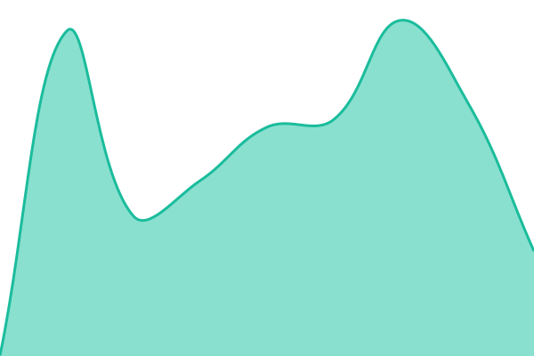

# [📈 Live Status](https://status.cheddaboards.com): <!--live status--> **🟩 All systems operational**

This repository contains the open-source uptime monitor and status page for [CheddaTech](https://cheddatech.com), powered by [Upptime](https://github.com/upptime/upptime).

With [Upptime](https://upptime.js.org), you can get your own unlimited and free uptime monitor and status page, powered entirely by a GitHub repository. We use [Issues](https://github.com/cheddatech/status/issues) as incident reports, [Actions](https://github.com/cheddatech/status/actions) as uptime monitors, and [Pages](https://status.cheddatech.com) for the status page.

<!--start: status pages-->
<!-- This summary is generated by Upptime (https://github.com/upptime/upptime) -->
<!-- Do not edit this manually, your changes will be overwritten -->
<!-- prettier-ignore -->
| URL | Status | History | Response Time | Uptime |
| --- | ------ | ------- | ------------- | ------ |
|  [API](https://api.cheddaboards.com/health) | 🟩 Up | [api.yml](https://github.com/cheddatech/status/commits/HEAD/history/api.yml) | 

 411ms
     
 | 

<a href="https://status.cheddatech.com/history/api">100.00%</a>
    

|  [Leaderboards (on-chain)](https://fdvph-sqaaa-aaaap-qqc4a-cai.raw.icp0.io/games/test-game/scoreboards/all-time?limit=1) | 🟩 Up | [leaderboards-on-chain.yml](https://github.com/cheddatech/status/commits/HEAD/history/leaderboards-on-chain.yml) | 

 437ms
     
 | 

<a href="https://status.cheddatech.com/history/leaderboards-on-chain">100.00%</a>
    

|  [Website](https://cheddaboards.com) | 🟩 Up | [website.yml](https://github.com/cheddatech/status/commits/HEAD/history/website.yml) | 

 595ms
     
 | 

<a href="https://status.cheddatech.com/history/website">100.00%</a>
    

|  [Docs](https://docs.cheddaboards.com) | 🟩 Up | [docs.yml](https://github.com/cheddatech/status/commits/HEAD/history/docs.yml) | 

 538ms
     
 | 

<a href="https://status.cheddatech.com/history/docs">100.00%</a>
    

<!--end: status pages-->

[**Visit our status website →**](https://status.cheddaboards.com)

## 📄 License

- Powered by: [Upptime](https://github.com/upptime/upptime)
- Code: [MIT](./LICENSE) © [Anand Chowdhary](https://anandchowdhary.com)
- Data in the `./history` directory: [Open Database License](https://opendatacommons.org/licenses/odbl/1-0/)
